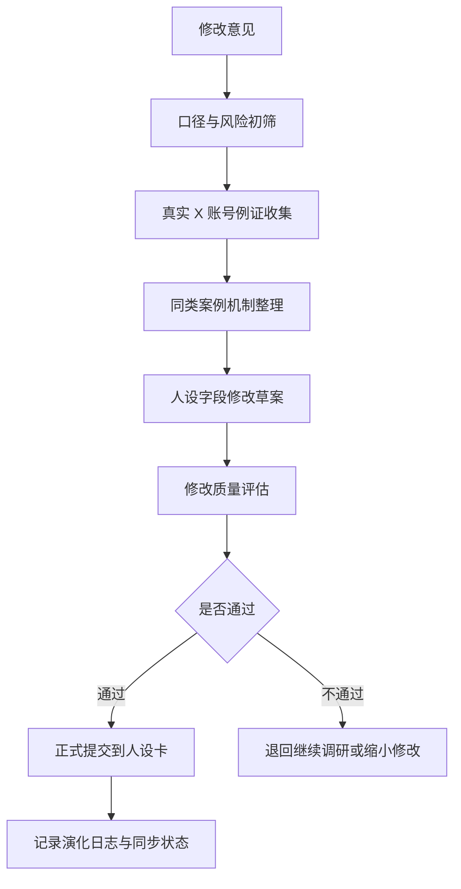

# 人设更新工作流规范

更新时间：2026-05-10

本流程参考 `vision-market/agent_packs/account_matrix_workflow_pack` 的账号矩阵构建方法，收敛为单账号或多账号人设更新 SOP。目标不是模仿外部账号，而是用真实社交媒体例证验证人设修改是否更清晰、更可写、更适合 X 冷启动。

## 适用场景

- 创作者反馈某个账号声音不够清楚。
- 主页名称、头像、bio、标语、Pinned Post 需要更新。
- 账号内容跑偏、声音趋同或无法持续生产。
- 需要用真实 X 账号案例支持一次人设升级。

## 文件落点

```text
accounts/{accountName}/change-requests/{YYYY-MM-DD}-{change-id}.md
accounts/{accountName}/social-evidence/{YYYY-MM-DD}-{change-id}-evidence.md
accounts/{accountName}/persona-evolution/{YYYY-MM-DD}-{change-id}-decision.md
accounts/{accountName}/assets/profile-screenshots/
```

## 流程总览



## Step 1：记录修改意见

输入可以来自创作者、运营、数据复盘或账号负责人。必须写清：

- 修改对象：账号、字段、主页资产或语气规则。
- 当前问题：哪里不清楚、不可写、不可持续或和账号定位冲突。
- 期望变化：希望更锋利、更温和、更真实、更专业或更适合互动。
- 影响范围：是否影响 `content-system` 的 persona 字段、主页资产、模板和 brief。

使用模板：`templates/persona-change-request-template.md`。

## Step 2：口径与风险初筛

先检查修改是否触碰 VisionTree 全局边界：

- 不能写成 AI 替人思考。
- 不能写成自动决策系统。
- 不能写成成熟第二大脑、知识管理工具、模型库、prompt 库或 skill 平台。
- 不能把 Tree 写成当前成熟产品能力。
- 不能虚构用户结果、平台数据或产品成熟度。

不通过初筛的修改直接退回，不进入例证调研。

## Step 3：真实 X 账号例证收集

每次重要修改至少收集 5-10 个真实 X 账号或品牌样本。轻量修改可收集 3-5 个。

每个样本至少记录：

- X 主页链接。
- 主页截图存放路径。
- 相关主题。
- 热度或可信度信号。
- 2-3 条真实内容样例链接或摘要。
- 这个样本的人格机制。
- 对当前账号的可迁移点和不可照搬点。

使用模板：`templates/social-evidence-research-template.md`。

## Step 4：同类案例机制整理

不要直接复制外部账号表面风格。需要归纳机制：

- 可信度从哪里来。
- 为什么有人持续看。
- 互动来自观点、故事、图解、实测、情绪共鸣还是人格张力。
- 高互动内容通常如何开头。
- 迁移到 VisionTree 时会不会牺牲口径准确性。

输出一张“可迁移机制表”，再决定是否修改人设字段。

## Step 5：人设字段修改草案

草案必须明确影响哪些字段：

- `displayName`
- `handle`
- `profileUrl`
- `positioning`
- `personaRole`
- `voice`
- `contentTypes`
- `avoid`
- `cadence`
- `interactionTarget`
- X 主页资产：头像、banner、bio、tagline、Pinned Post

字段修改要同时写“旧值 / 新值 / 修改理由 / 例证依据 / 风险”。

## Step 6：修改质量评估

正式提交前按 5 个维度打分，每项 1-5 分：

| 维度 | 判断问题 |
| --- | --- |
| 口径准确 | 是否守住 VisionTree 边界 |
| 账号差异 | 是否让该账号更不像其他账号 |
| 创作者可用 | 是否能指导真实写作，而不是抽象形容 |
| X 适配 | 是否适合主页、短帖、评论区和冷启动 |
| 证据充分 | 是否有真实社媒样本支撑 |

建议总分低于 20 分不提交。任一项低于 3 分必须退回修改。

## Step 7：正式提交

通过评估后：

1. 更新 `accounts/{accountName}/00_persona_card.md`。
2. 更新 `accounts/{accountName}/01_x_profile_assets.md`，如涉及主页资产。
3. 在 `accounts/{accountName}/03_persona_evolution_log.md` 写入版本记录。
4. 在 `persona-index.md` 更新状态。
5. 如需同步 `content-system`，标记为 `待同步`，不要假装已同步。

## 最小交付标准

一次完整人设升级至少包含：

- 1 个修改请求。
- 3-10 个真实 X 样本。
- 样本主页截图或截图待补标记。
- 真实内容样例。
- 可迁移机制表。
- 字段修改草案。
- 质量评估表。
- 正式提交记录或退回原因。
